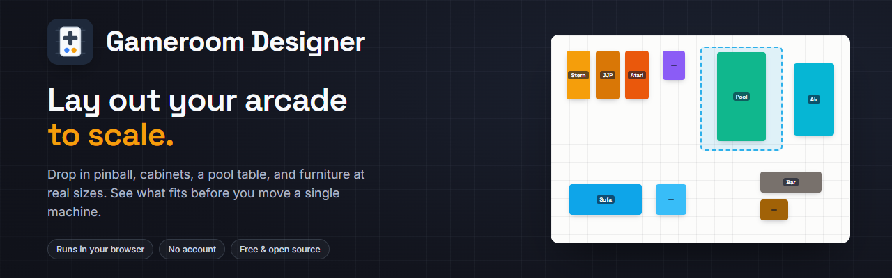
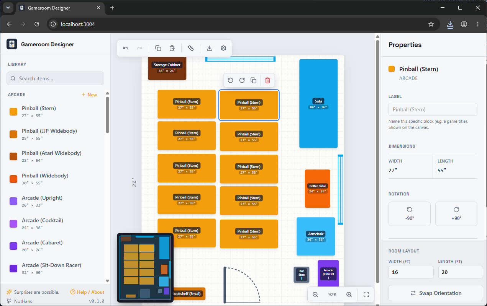

<p align="center">
  
</p>

# Gameroom Designer

A 2D room layout planner for arranging things to scale. Set your room's real dimensions,
drop in scaled items (pinball machines, arcade cabinets, a pool table, furniture, storage,
decor), slide them around until it works, and export the plan as a PNG.

Everything runs in the browser. Your layout is saved to `localStorage`, so there's no account,
no server, and nothing leaves your machine.

**[Try it live →](https://nothans.github.io/gameroom-designer/)**

<p align="center">
  
</p>

## Features

- **Room to scale**: set width and length in feet, switch between imperial and metric.
- **Searchable item palette**: filter by name, then **click or drag** an item onto the room. New items
  auto-place into the first open spot (no pile-up).
- **Real-world catalog**: pinball (Stern, JJP, Atari, and generic widebodies), arcade cabinets
  (upright, cocktail, cabaret, sit-down racer), game tables (pool, air hockey, foosball, ping pong,
  shuffleboard, poker), plus furniture, storage, decor, and structural pieces (walls, doors with swing
  arcs, windows). Every item is sized in real inches.
- **Clearance zones**: drop a resizable dashed *Clearance* area (rectangular or circular) to reserve the
  room people need: cue clearance around a pool table, pull-back room in front of a cabinet, a dartboard throw
  circle, walking lanes.
- **Name any block**: give a placed block a custom label (a specific game title, say) shown on the canvas.
- **Arrange freely**: drag, rotate, resize, multi-select, copy/paste. Rotate right from a floating menu on the
  selected block.
- **Zoom, fit & pan**: zoom in/out (buttons or Ctrl/⌘ + scroll), one-click *fit to screen*, and an overview
  **minimap** to jump around large rooms. Block labels scale and simplify as you zoom.
- **Multi-select tools**: select several blocks (marquee or shift-click) and align edges/centers, distribute
  with even gaps, or rotate/remove them together from the Properties panel.
- **Snap-to-grid**: optional, with a configurable grid size.
- **Undo / redo**: full history. Keyboard shortcuts throughout (see Help / About): undo/redo, copy/paste,
  `R` / `[` / `]` to rotate, `Del` to remove, `Esc` to deselect, ⌘/Ctrl + scroll to zoom.
- **Custom items**: add your own templates with real-world dimensions.
- **Examples**: start from a bundled layout (Basement Arcade, Pinball Row, Pool & Play) in one click.
- **Import / export**: save a layout to a versioned JSON file and load it back (validated on import).
- **Export image**: save the current layout as a PNG.
- **Ruler**: measure distances on the canvas.
- **Display options**: toggle the grid and on-block dimensions; switch imperial/metric.
- **Auto-save + reset**: layout, room size, custom items, and settings persist locally; clear everything with a
  confirmation from Settings.

## Quick start

```bash
npm install
npm run dev      # http://localhost:3000
```

Build a static bundle:

```bash
npm run build
npm run preview  # preview the production build
```

## Deploy (GitHub Pages)

The app is client-only, so GitHub Pages can host the built `dist/`. This repo ships a workflow
(`.github/workflows/deploy.yml`) that builds and deploys on every push to `main`. One-time setup:
in the repo, go to **Settings → Pages → Build and deployment → Source: GitHub Actions**. After the
next push the site is live at `https://nothans.github.io/gameroom-designer/`.

The production build uses the base path `/gameroom-designer/` (set in `vite.config.ts`); local dev
stays at `/`. If you fork under a different repo name, update that base to match.

## Testing

End-to-end tests (Playwright) cover the key workflows: adding items, the floating rotate menu, the clearance
zone, loading examples, import/export round-trips, clearing data, zoom, and display toggles:

```bash
npx playwright install chromium   # one-time
npm run test:e2e                  # headless run (starts its own dev server)
npm run test:e2e:ui               # interactive UI mode
```

## Examples

The [`examples/`](examples) folder holds ready-made layouts as versioned JSON. Load one in-app from
**Settings → Start from an example**, or import any of these files via **Settings → Import JSON**.

## Tech stack

React 19, Vite 6, TypeScript, Tailwind CSS v4, [`lucide-react`](https://lucide.dev) for icons,
and [`html-to-image`](https://github.com/bubkoo/html-to-image) for PNG export. No backend.

## How it works

The canvas uses a fixed scale of 3 pixels per inch. Items carry their real dimensions in inches,
so a 27" x 55" pinball machine takes up the right amount of room next to an 84" sofa. State lives
entirely in the browser via `localStorage` under `roomPlanner_*` keys.

## License

[MIT](LICENSE) © Hans Scharler
